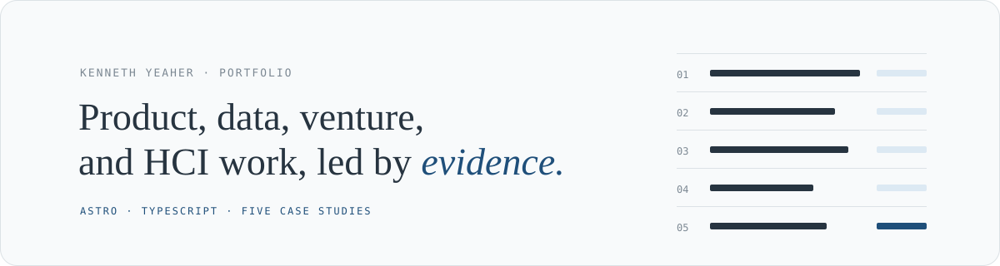
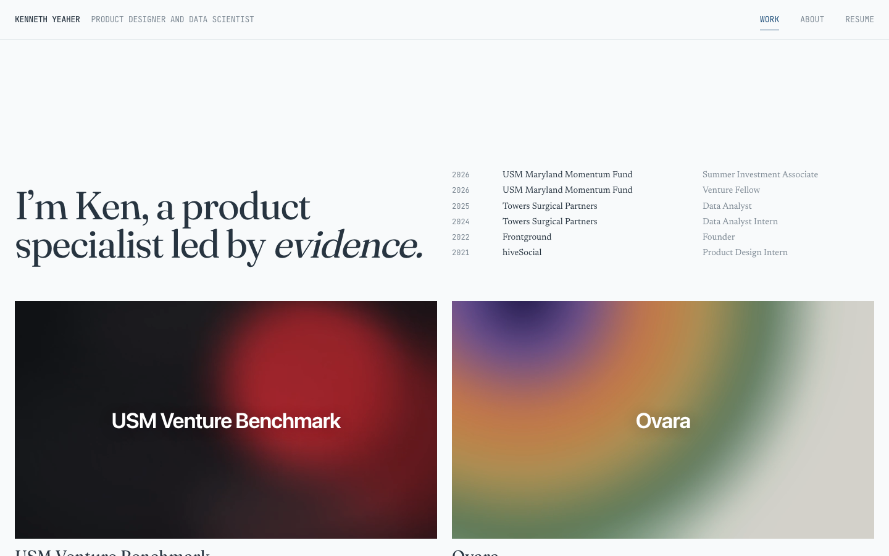
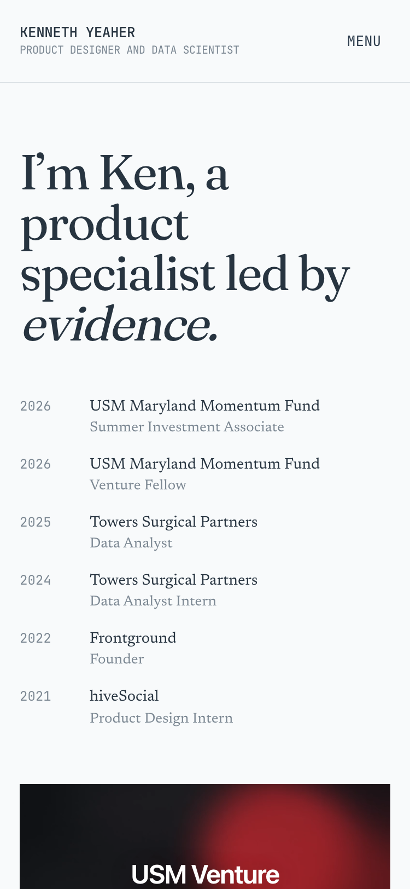

<p align="center">
  
</p>

<p align="center">
  <strong>An editorial portfolio for Kenneth Yeaher’s product, data, venture, and human-computer interaction work.</strong><br>
  The site is built with Astro and TypeScript and uses one verified content model for the Work page and eight case studies.
</p>

<p align="center">
  
  
  
  <a href="https://kennethyeaher.github.io/"></a>
  <a href="https://github.com/kennethyeaher/kennethyeaher.github.io/actions/workflows/deploy.yml"></a>
</p>

<p align="center">
  <a href="https://kennethyeaher.github.io/"><strong>Open the portfolio ↗</strong></a> &nbsp; · &nbsp;
  <a href="#how-the-portfolio-fits-together">How it fits together</a> &nbsp; · &nbsp;
  <a href="#verification">Verification</a> &nbsp; · &nbsp;
  <a href="#editing-content">Editing content</a>
</p>

---



<details>
<summary><strong>See the mobile layout</strong></summary>
<br>
<p align="center"></p>
</details>

<sub>The published site before the current local redesign, captured October 3, 2026.</sub>

## My contribution

I brought my project narratives and source artifacts into a shared content model, built the portfolio pages and navigation, and added content and asset checks. Individual case studies retain their own research and collaboration context.

## How the portfolio fits together

The Work page provides a quick entry into the projects. Each case study then connects the problem, my role, source artifacts, and limitations. The About page supplies personal context, and the résumé remains available as a direct PDF download.

For a technical review, start with the shared content model in `src/data/portfolio.mjs`, then follow it into the page components. Separating content from presentation keeps project descriptions consistent across cards and detailed pages.

## Local preview

```bash
npm ci
npm run dev
```

The default local address is `http://127.0.0.1:4321/` when the preview is started with the host and port used during QA.

## Verification

```bash
npm test
npm run check
npm run build
```

- `npm test` checks the content model, navigation shell, Work and About pages, case-study routes, factual guardrails, media references, and résumé integrity.
- `npm run check` runs Astro and TypeScript diagnostics.
- `npm run build` generates eight project social cards, then produces the static site in `dist/`.

Project covers show existing interface screens or research artifacts. Cover motion loads on hover or focus; case-study heroes provide a playback control. Theme choice follows the operating system until a visitor chooses light or dark. Page transitions, reveals, and cover depth respect reduced motion. Native navigation and content remain available without JavaScript.

## Current routes

| Route | Purpose |
|---|---|
| `/` | Work page with the editorial introduction, experience, and eight featured projects |
| `/about` | HCI-focused biography, identity lanes, and the real-photo-only gallery |
| `/work/[slug]` | Reusable evidence-led case-study page |
| `/resume/kyresume.pdf` | Byte-for-byte copy of the supplied master résumé PDF |

Former `/projects`, `/contact`, and `/education` URLs are retained as redirects so stale duplicate pages are not published.

## Editing content

The current public content lives in [`src/data/portfolio.mjs`](src/data/portfolio.mjs). It controls:

- header identity and contact links;
- home-page experience;
- About writing and gallery entries;
- project order, copy, metrics, media, and case-study chapters.

Add future user-supplied About photographs to the `aboutGallery` array only after placing the real files in `public/images/`. The page intentionally creates no empty photo placeholders.

Project visuals live under `public/images/work/`. Every visible project image is a user-approved source artifact or a direct Figma export. Do not substitute CSS drawings, handcrafted SVGs, emoji, or generic placeholders for evidence.

## Structure

```text
src/
  components/       Shared navigation, cards, gallery, media, and case-study UI
  data/portfolio.mjs
  layouts/Base.astro
  pages/
    index.astro
    about.astro
    work/[slug].astro
  scripts/site.ts   Mobile navigation, reveal behavior, chapter state, and cursor
  styles/global.css
public/
  images/work/
  resume/kyresume.pdf
tests/
qa/                 Browser captures and the source-to-implementation comparison
design-qa.md         Final visual QA record
```

## Published site

The portfolio is published at [kennethyeaher.github.io](https://kennethyeaher.github.io/). Pushes to `main` are verified and deployed automatically through GitHub Pages.

---

## Author

**Kenneth Yeaher**  
MS in Human Computer Interaction  
University of Maryland, College Park  
[](https://www.linkedin.com/in/kennethyeaher/)

`Astro` · `TypeScript` · `Portfolio Design`

## Deferred content

Fun and Coursework remain deferred until their content and artifacts are assembled. Their pages and navigation entries are not part of this update. Annotation, comparison, and recorded video exhibits are supported by the media renderer; publish them only when the matching source material and authored explanation are available.
