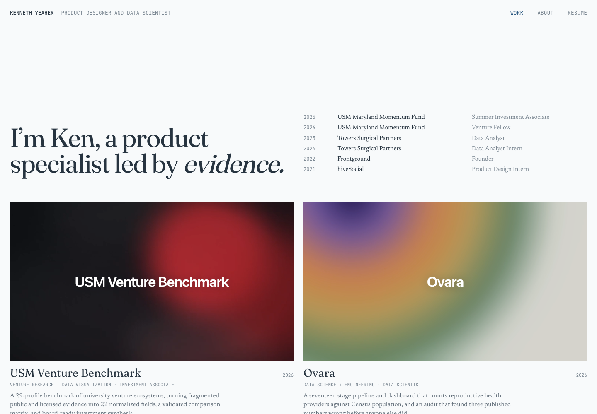

# Kenneth Yeaher Portfolio

A light-mode editorial portfolio for Kenneth Yeaher’s product, data, venture, and human-computer interaction work. The site is built with Astro and TypeScript and uses one verified content model for the Work page and five case studies.




The published portfolio, captured September 26, 2026.

## My contribution

I brought my project narratives and source artifacts into a shared content model, built the portfolio pages and navigation, and added content and asset checks. Individual case studies retain their own research and collaboration context.

## Local preview

```bash
npm ci
npm run dev
```

The default local address is `http://127.0.0.1:4321/` when the preview is started with the host and port used during QA.

## Verification

```bash
npm test
npm run check
npm run build
```

- `npm test` checks the content model, navigation shell, Work and About pages, case-study routes, factual guardrails, media references, and résumé integrity.
- `npm run check` runs Astro and TypeScript diagnostics.
- `npm run build` produces the static site in `dist/`.

## Current routes

| Route | Purpose |
|---|---|
| `/` | Work page with the editorial introduction, experience, and five featured projects |
| `/about` | HCI-focused biography, identity lanes, and the real-photo-only gallery |
| `/work/[slug]` | Reusable evidence-led case-study page |
| `/resume/kyresume.pdf` | Byte-for-byte copy of the supplied master résumé PDF |

Former `/projects`, `/contact`, and `/education` URLs are retained as redirects so stale duplicate pages are not published.

## Editing content

The current public content lives in [`src/data/portfolio.mjs`](src/data/portfolio.mjs). It controls:

- header identity and contact links;
- home-page experience;
- About writing and gallery entries;
- project order, copy, metrics, media, and case-study chapters.

Add future user-supplied About photographs to the `aboutGallery` array only after placing the real files in `public/images/`. The page intentionally creates no empty photo placeholders.

Project visuals live under `public/images/work/`. Every visible project image is a user-approved source artifact or a direct Figma export. Do not substitute CSS drawings, handcrafted SVGs, emoji, or generic placeholders for evidence.

## Structure

```text
src/
  components/       Shared navigation, cards, gallery, media, and case-study UI
  data/portfolio.mjs
  layouts/Base.astro
  pages/
    index.astro
    about.astro
    work/[slug].astro
  scripts/site.ts   Mobile navigation, reveal behavior, chapter state, and cursor
  styles/global.css
public/
  images/work/
  resume/kyresume.pdf
tests/
qa/                 Browser captures and the source-to-implementation comparison
design-qa.md         Final visual QA record
```

## Published site

The portfolio is published at [kennethyeaher.github.io](https://kennethyeaher.github.io/). Pushes to `main` are verified and deployed automatically through GitHub Pages.

---

## Author

**Kenneth Yeaher**  
Master of Information Management  
University of Maryland, College Park  
[](https://www.linkedin.com/in/kennethyeaher/)

`Astro` · `TypeScript` · `Portfolio Design`
